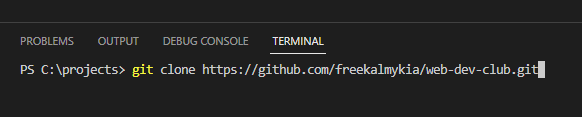

# How to create markdown article, push it GitHub and raise PR

> #### Prerequisites:
> - VSCode. 
>   - [Install](https://code.visualstudio.com/)
>   - [How to install VSCode (ENG)](https://www.youtube.com/watch?v=H2gvHxC9gFY), [Как установить VSCode (рус)](https://www.youtube.com/watch?v=JSGPd1E16-o)
> - Git and GitHub
>   - [Install](https://git-scm.com/)
>   - [Create GitHub Account](https://github.com)
>   - [How to install Git (ENG)](https://www.youtube.com/watch?v=4xqVv2lTo40), [Как установить Git (рус)](https://www.youtube.com/watch?v=GsG5roSGha0)
>   - [How to create GitHub account (ENG)](https://www.codecademy.com/article/how-to-set-up-a-github-account), [Как создать GitHub аккаунт (рус)](https://htmlacademy.ru/blog/git/github-account)

1. Create `projects` folder in the root folder of disk C: `C:\projects`

2. Enter this folder, click on the right button of the mouse and select `Open with VSCode`.
3. Open Terminal in the VSCode `View -> Terminal`
4. Open web browser and navigate to https://github.com/freekalmykia/web-dev-club
5. Click on green `<> Code` button. Click copy to save URL into the clipboard.

6. Go back to VSCode and execute the following command in the terminal:
`git clone https://github.com/freekalmykia/web-dev-club.git`

7. A new folder with name `web-dev-club` appears in the `C:\projects` folder.
Use `cd web-dev-club` to enter into the folder.

8. Execute `dir` or `ls` commands to list the content of `web-dev-club` folder
