# How to create markdown article, push it to GitHub and raise Pull Request

> #### Prerequisites:
> - VSCode. 
>   - [Install](https://code.visualstudio.com/)
>   - [How to install VSCode (ENG)](https://www.youtube.com/watch?v=H2gvHxC9gFY), [Как установить VSCode (рус)](https://www.youtube.com/watch?v=JSGPd1E16-o)
> - Git and GitHub
>   - [Install](https://git-scm.com/)
>   - [Create GitHub Account](https://github.com)
>   - [How to install Git (ENG)](https://www.youtube.com/watch?v=4xqVv2lTo40), [Как установить Git (рус)](https://www.youtube.com/watch?v=GsG5roSGha0)
>   - [How to create GitHub account (ENG)](https://www.codecademy.com/article/how-to-set-up-a-github-account), [Как создать GitHub аккаунт (рус)](https://htmlacademy.ru/blog/git/github-account)

1. Create `projects` folder in the root folder of disk C: `C:\projects`

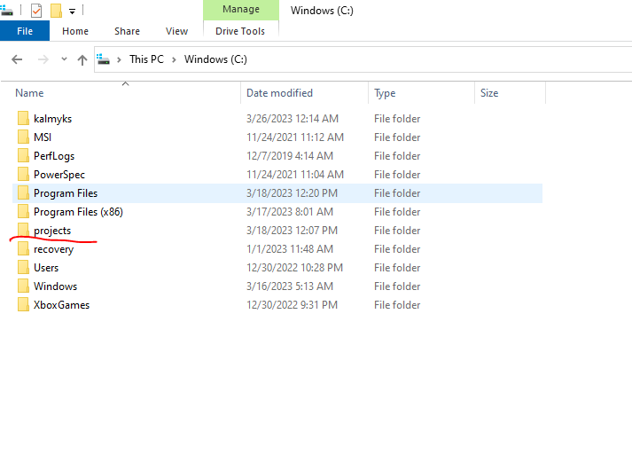

2. Enter this folder, click on the right button of the mouse and select `Open with VSCode`.
3. Open Terminal in the VSCode `View -> Terminal`
4. Open web browser and navigate to https://github.com/freekalmykia/web-dev-club
5. Click on green `<> Code` button. Click copy to save URL into the clipboard.
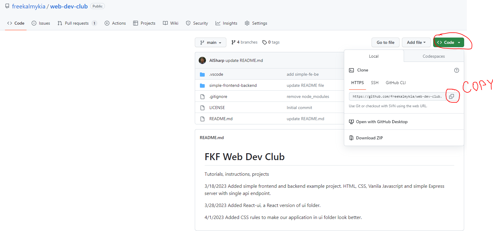
6. Go back to VSCode and execute the following command in the terminal:
>Attention: If you already have this repository on your computer, then enter the folder `cd web-dev-club` and execute `git pull`
> 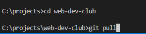

If you don't have the repository on your PC, then execute the following command (it will clone repo from guthub to your PC)
`git clone https://github.com/freekalmykia/web-dev-club.git`
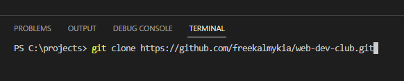
7. A new folder with name `web-dev-club` appears in the `C:\projects` folder.
Use `cd web-dev-club` to enter into the folder.
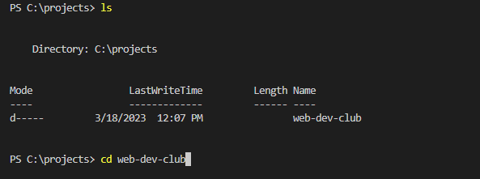
8. Execute `dir` or `ls` commands to list the content of `web-dev-club` folder
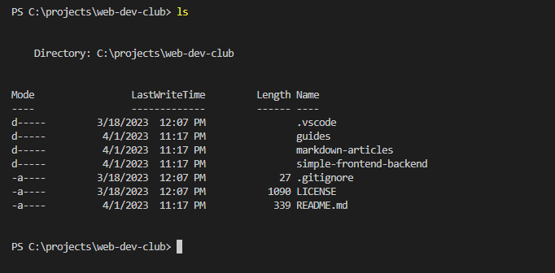
We have `markdown-articles` folder where we are going to create .md files.
9. Before we make any changes, we have to create new git branch.
Execute the following command (use your name instead of the name in the example):
`git checkout -b anna-first-markdown-file`
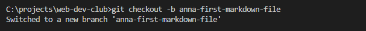
10. Execute `cd markdown-articles` to enter the folder.
11. In the `markdown-articles` folder, create a folder with your name or nickname. For example: `mkdir anna`.
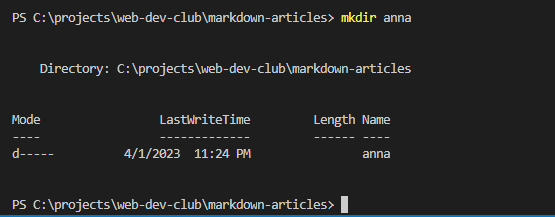
12. Enter your folder `cd anna`.
13. Now is the time to create your first markdown file. Execute the following command
`New-Item my-first-article.md`
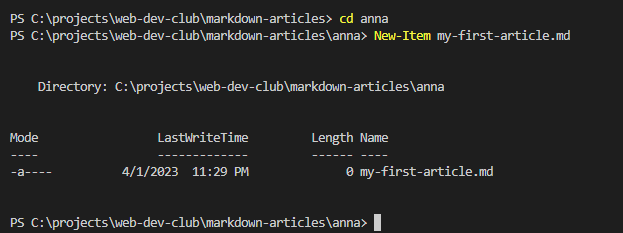
You can also create a new file from the panel on the left (Explorer):
Click on `anna` folder and then click on `New file...`
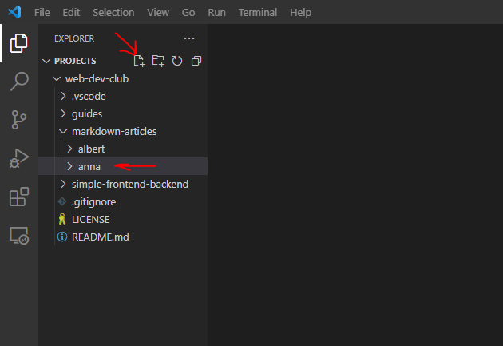
Name your file `my-first-article.md`
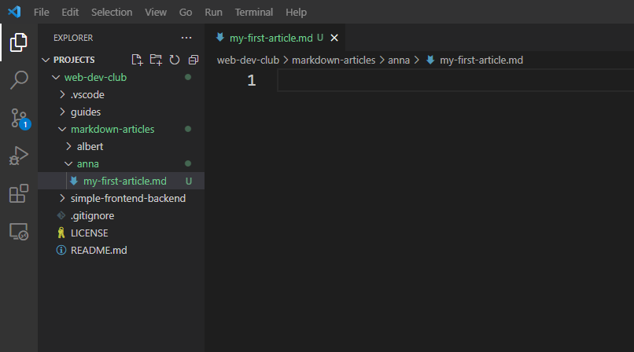
14. Copy and paste the following text:
```md
# This is my first Markdown article

My name is Anna. Today is April 1, 2023.
```
Save the file `Ctrl + S` or `File -> Save` from the menu.
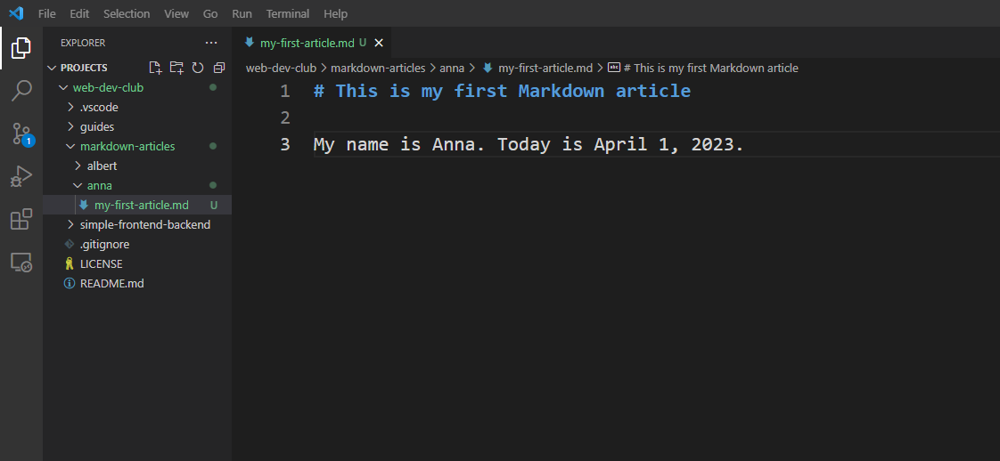
15. Now we can commit our changes to our branch and push our branch to Github.
Execute the follwing commands:
`git status`
`git add .`
`git status`
`git commit -m "anna: add my first article"`
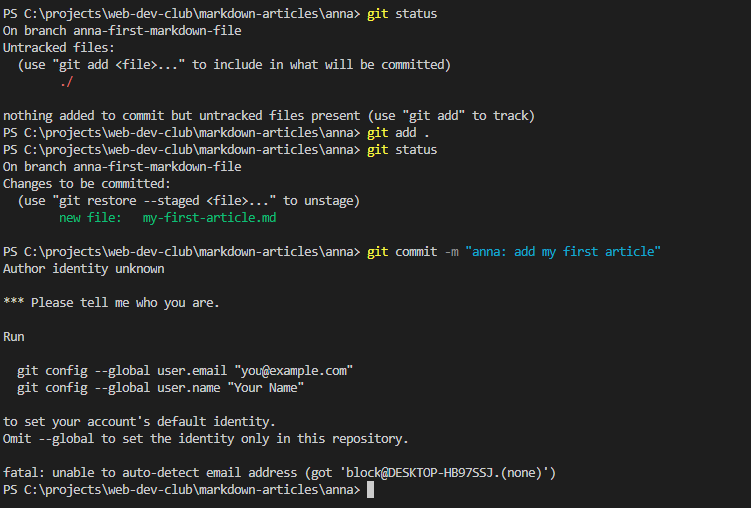

> Attention! If you see `Author identity unknown` after `git commit` command, you have to set up github configuration.
> It means that you have to provide your email and name.
> Replace you@example.com and Your Name with your email and name in the following commands
> Run these commands with you email (email from your github account) and name:
> `git config --global user.email "you@example.com"`
> `git config --global user.name "Your Name"`
> 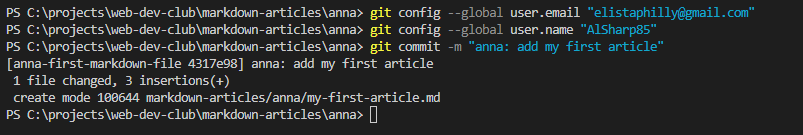
16. After we commit your code changes into your local branch, you can push your branch to Github. Execute the following command:
`git push`
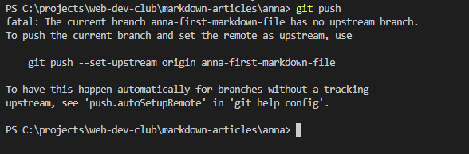
> Attention! Because your branch is new and does not exist on Github yet, you have to use `git push` with additional parameters
> Run command as suggested `git push --set-upstream origin anna-first-markdown-file`
> If you get asked in the popup windows to sign in, try to close the popup
> 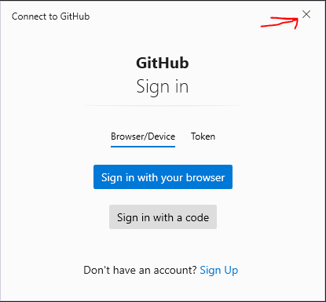
17. Your branch was uploaded on Github. If you go back to you web browser, you will see that `anna-first-markdown-file` had recent pushes. Click on `branches`
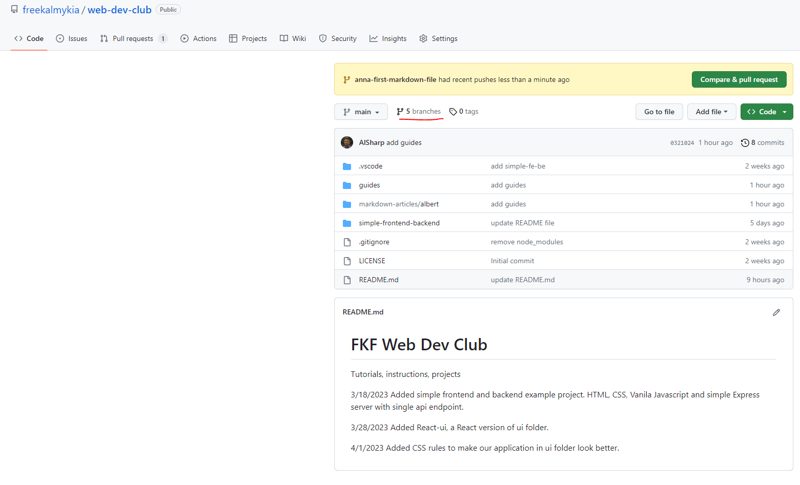
18. Find the branch you pushed and click `Create new pull request`
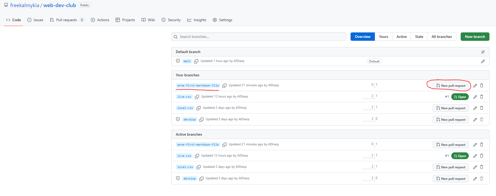
19. Select `develop` in *base* branch, select `AlSharp` or `dalan0892` in *Reviewers*, assign yourself in *Assignees*, select `documentation` in *Labels*. Click `Create pull request`. 
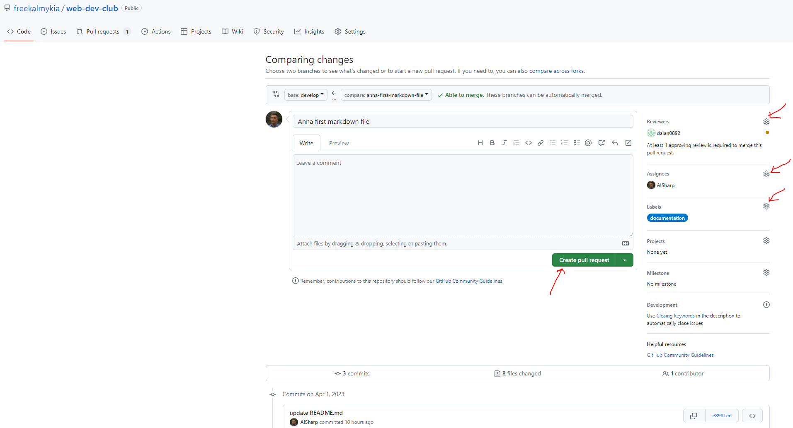
20. Congratulation! You created your first pull request. It says that you want to merge number of commits into `develop` from `anna-first-markdown-file`. Click on `Pull requests` to see all current pull requests. Mission is accomplished!
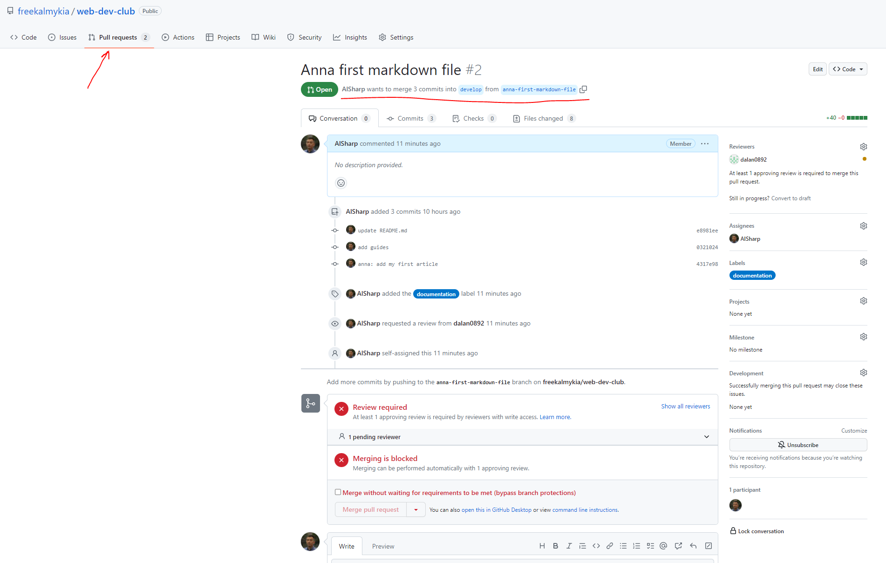
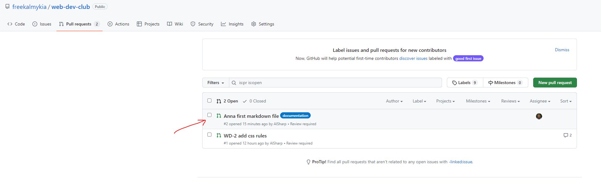
